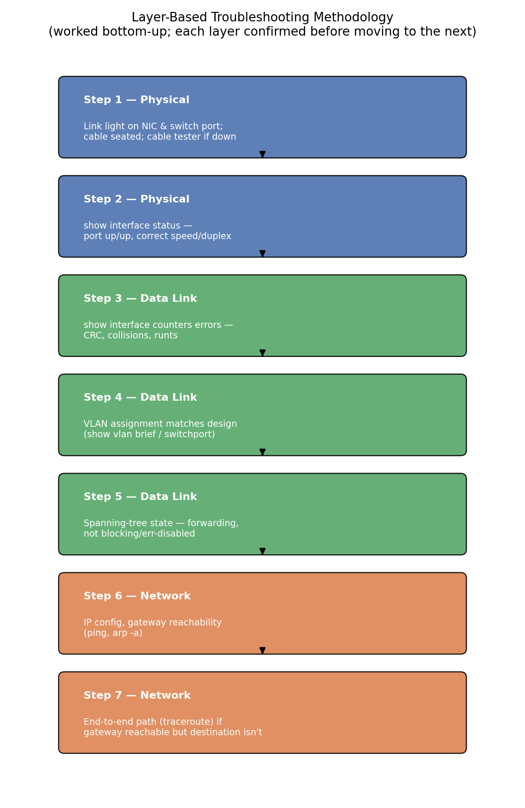
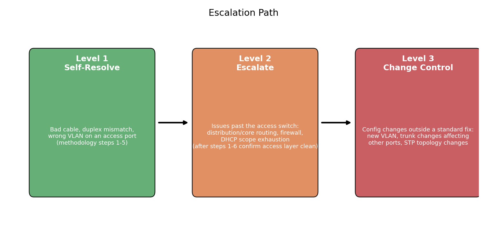

# Network Connectivity Troubleshooting & Switch Port Validation

**Data Center Technician portfolio project — Surya Teja Gamidi**

This project documents a structured, repeatable approach to diagnosing network connectivity issues at the access layer and validating switch port configuration before and after any rack or cabling change — the kind of work that follows directly from the [Data Center Rack Development & Capacity Expansion Plan](https://github.com/Suryatejagamidi11/data-center-capacity-expansion-plan), where new rows of switches and hundreds of new cable runs need to be confirmed good before they carry production traffic.

The core idea: most "the network is down" tickets are actually one of a small number of root causes — physical layer faults, duplex/speed mismatch, VLAN misconfiguration, port security lockout, or spanning-tree state — and a bottom-up, layer-by-layer methodology finds the real cause faster than guessing at the application layer first.

**What this project covers:**

1. A layer-based troubleshooting methodology (physical → data link → network) used consistently on every ticket.
2. A standard switch port validation procedure run after any new cable pull or port reconfiguration.
3. A playbook mapping common symptoms to likely causes and resolutions.
4. A ready-to-use validation checklist that turns the methodology into something that can be run in the field.



---

## Repository Structure

```
network-troubleshooting-switch-validation/
├── README.md                          ← you are here
├── LICENSE
├── docs/
│   ├── 01-scope-objectives.md
│   ├── 02-troubleshooting-methodology.md
│   ├── 03-switch-port-validation-procedure.md
│   ├── 04-common-issues-playbook.md
│   ├── 05-tools-commands-reference.md
│   ├── 06-documentation-escalation.md
│   ├── 07-safety-considerations.md
│   └── 08-validation-checklist.md
├── diagrams/
│   ├── troubleshooting-methodology.png
│   └── escalation-path.png
└── scripts/
    ├── make_methodology_diagram.py
    └── make_escalation_diagram.py
```

## Contents

| # | Section | What's in it |
| --- | --- | --- |
| 01 | [Scope & Objectives](docs/01-scope-objectives.md) | What's covered, measurable targets, equipment in scope |
| 02 | [Troubleshooting Methodology](docs/02-troubleshooting-methodology.md) | 7-step layer-based diagnostic process |
| 03 | [Switch Port Validation Procedure](docs/03-switch-port-validation-procedure.md) | Pre-production checks for every new cable pull |
| 04 | [Common Issues Playbook](docs/04-common-issues-playbook.md) | Symptom → likely cause → resolution table |
| 05 | [Tools & Commands Reference](docs/05-tools-commands-reference.md) | CLI commands, host-side tools, hardware testers |
| 06 | [Documentation & Escalation Standards](docs/06-documentation-escalation.md) | Ticket logging fields, 3-level escalation path |
| 07 | [Safety Considerations](docs/07-safety-considerations.md) | ESD, fiber safety, live-rack awareness |
| 08 | [Sample Validation Checklist](docs/08-validation-checklist.md) | Field-ready port sign-off checklist |

## At a Glance

| Objective | Target |
| --- | --- |
| Diagnose a reported connectivity issue to root cause | Under 20 minutes for access-layer issues, following the methodology |
| Validate every newly cabled switch port before go-live | 100% of new ports checked against the validation procedure |
| Reduce repeat tickets caused by unresolved root cause | No repeat ticket on the same port within 30 days |
| Standardize documentation so any technician can pick up a ticket | Every ticket logged with symptom, layer isolated, root cause, and fix |

**Scope:** access-layer copper and fiber connectivity between end devices (servers, ToR switches) and the distribution layer. Does not cover routing protocol troubleshooting, firewall rules, or WAN circuits. Commands reference Cisco IOS syntax; the same steps translate to other vendors' equivalents.

## Escalation Path



Full detail in [06-documentation-escalation.md](docs/06-documentation-escalation.md).

---

## About

Author: **Surya Teja Gamidi** — pursuing a Data Center Technician career, OSHA 10-Hour Construction Safety and Health certified.

This project pairs with the [Data Center Rack Development & Capacity Expansion Plan](https://github.com/Suryatejagamidi11/data-center-capacity-expansion-plan): that project builds and cables the racks, this one validates and troubleshoots the network connectivity on them before and after they carry production traffic.
